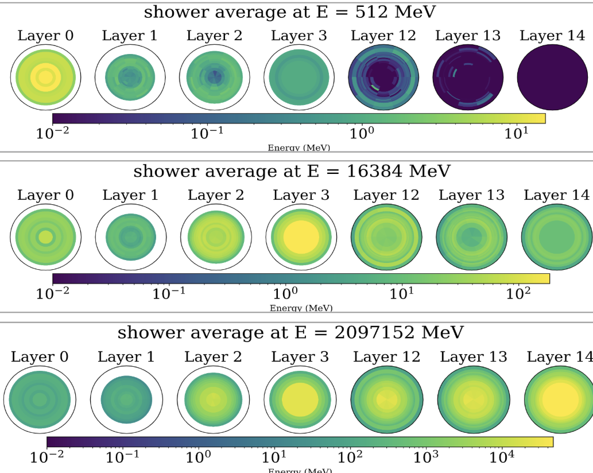

# Introduction

This repository contains the work I carried out during my research internship on **CaloINN**, a generative model designed to simulate calorimeter showers in high-energy physics.

CaloINN was introduced as part of the [CaloChallenge](https://arxiv.org/pdf/2410.21611) and is described in detail in the paper [_“Detector Flows: Unfolding Physics with Invertible Networks”_](https://arxiv.org/pdf/2312.09290).  
The official implementation and installation instructionsis are available here: [CaloINN GitHub](https://github.com/heidelberg-hepml/CaloINN).

The goal of this project was to improve and better understand the **evaluation strategy** of the model and assess its **generalization ability** to new energies.

---

## First task : Modified classifier

I trained a new binary classifier to distinguish between Geant4 and CaloINN-generated showers.

The original classifier was designed to work across the entire dataset, including the most complex examples, while my experiments focused on the simplest one.  
I therefore trained a classifier better suited to this dataset, which reached a similar AUC but maintained a more consistent performance between the training and validation sets (unlike the default classifier, which tended to overfit).

---

## Second task : Interpolation ability

📎 [Link to slides](https://docs.google.com/presentation/d/1jx-MW-ouCg9Mh47UmSEipwo6ShP4LfuDstoIUW8cMYE/edit?usp=sharing)

CaloChallenge datasets contain discrete energy values following powers of two.  
However, in practice, one might want to generate showers at intermediate energies. I therefore studied how well **CaloINN can interpolate to energies it has not seen during training**.

To test this, I removed all events at a given energy from the training set, and evaluated the model’s performance on that specific energy (Slide 20-21).

I explored three cases:
- **Medium energy (16 GeV)**: good interpolation both in AUC and chi-squared distance metrics (Slides 22, 23)
- **Low energy (512 MeV)**: interpolation was acceptable, but performance was limited due to the high complexity and variability of low-energy showers (Slides 24, 25, 26) 
- **High energy (2 TeV)**: good results at first sight, but I found they were biased due to the very small number of examples, making it hard for the classifier to learn (Slides 27, 28)

To confirm this last point, I ran two control checks (Slide 29) :
- I trained a classifier on a dataset where the number of 16 GeV events was reduced to match the number of 2 TeV events -> AUC dropped similarly  
- I trained a classifier on the full dataset but evaluated it only on 2 TeV -> higher AUC, confirming that more training samples improve learning

These tests supported the idea that the original AUC score at 2 TeV was not reliable, as the classifier had too little information to learn effectively.

